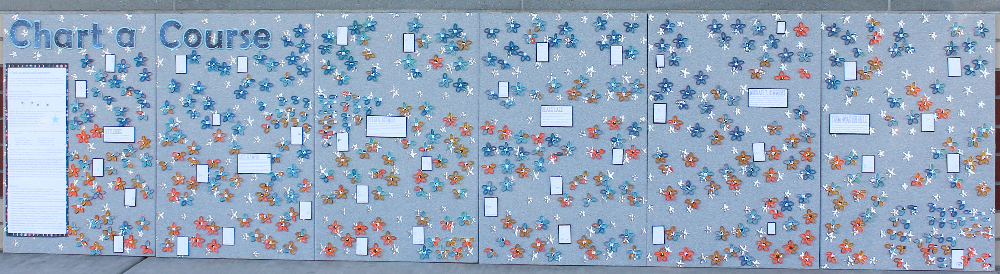

# Chart a Course

 

How does a student's path through our system connect with their performance in math?

[Overview](https://tlricherson.github.io/ChartACourse/#overview) | [How to read the display](https://tlricherson.github.io/ChartACourse/#how-to-read-the-display) | [Construction](https://tlricherson.github.io/ChartACourse/#construction) | [Learn more](https://tlricherson.github.io/ChartACourse/#learn-more) | [About the artist](https://tlricherson.github.io/ChartACourse/#about-the-artist)

## Overview ##
Every student has personal attributes that they bring to school. Student learning is affected also by other factors, such as curriculum and instruction. In this story, we look at how the external sequence of teachers and courses connects with the internal factors of students to impact longitudinal performance in math.

## How to read the display ##
Each student on the display is represented by a star. A star is made of 5 rays, representing the five grade levels (3 - 7). Grade 3 is in the 12 o'clock position, and the rest follow as you move clockwise around the star. If a student didn't attend one of our schools for a given grade level, there is no ray at that position.

 

The paper colour for each ray shows what the performance level was on the state math assessment for that grade. Orange is level one (well below standard), yellow is level two (below standard), light blue is level three (at standard), and dark blue is level four (above standard). Each ray is wrapped in a piece of coloured paper to indicate a particular teacher/school. We have six elementary schools serving grades 3 - 5, so there are six sets of colours: orange, purple, green, blue, red, and yellow. There are two middle schools serving grades 6 - 7, represented by blue and red. If a student attended one of our schools at a given grade level, but didn't take the test, the ray has the outer wrapper and is empty for the performance level.

On the inside of each star are four round disks of paper in white (w) and grey (g).

 

Here is a small group of students that shows the variations by missing grade levels, missing scores, gender, etc:

 

Coded names of teachers and students were uploaded into the [Connect the Dots](https://databasic.io/en/connectthedots/) tool to identify connections. These were used to form constellations of students who had similar experiences in terms of teachers or courses. Each of our six elementary schools has it's own board. Constellations for the school are placed and then identified with a small graphic (like the one shown at the right) to build understanding in viewers. 

There are two sets of three boards, representing our two feeder patterns into middle school. Each set of three elementary schools/1 middle school is on its own larger bulletin board. This allows for not only a comparison between elementary schools, but performance between middle schools for a cross-district view of student outcomes in math.

## Construction ##
The display represents 452 students and is made of more than 3200 pieces of quilled paper held together by glue. Each student representation is attached to a fabric-covered cork board by at least one map pin.

Each board is 2' x 3' (.6m x .9m) for a total size of 12' x 3' (3.65m x .9m). It is currently displayed by using picture hangers to attach it to two large bulletin boards in a hallway of our school district office.

## Learn more ##
We have been building large-scale, physical data displays for more than two years. After they have spent time in our school district office, we move them into other areas of the community, including [Capital Region Educational Service District 113](https://www.esd113.org/), the [Office of Superintendent of Public Instruction](https://www.k12.wa.us/), and (soon!) Evergreen State College and Timberland Regional Libraries.

Additional details about all of the displays are available on our district [Data Stories](https://www.tumwater.k12.wa.us/Page/7852) web site, or on my personal blog under the [stories](http://excelforeducators.blogspot.com/search/label/stories) label.

## About the artist ##
I'm a a career educator, with K - 12 experience in science curriculum, instructional coaching, and both small- and large-scale assessment. I currently work for a school district supervising assessments, presenting data, and completing other duties as assigned. I present at various state and national conferences on subjects like grading practices, data visualization, and classroom technology integration. 

[Contact](mailto:tara.richerson@gmail.com) | [Blog](http://excelforeducators.blogspot.com/) | [Twitter](https://twitter.com/science_goddess) | [LinkedIn](https://www.linkedin.com/in/tara-richerson-9b593753/)
